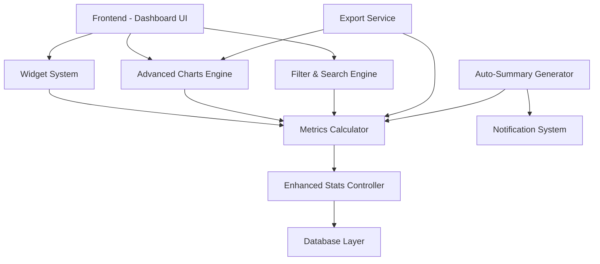

# Design Document - Dashboard Avanzado y Estadísticas Mejoradas

## Overview

El diseño del Dashboard Avanzado transforma la aplicación actual de estadísticas deportivas en una plataforma de análisis completa. La arquitectura se basa en un sistema modular de widgets, un motor de cálculo de métricas en tiempo real, y una capa de visualización avanzada que aprovecha Chart.js existente y lo extiende con nuevas capacidades.

La solución mantiene la simplicidad de uso actual mientras añade potentes capacidades de análisis, siguiendo principios de diseño responsive-first y progressive enhancement.

## Architecture

### High-Level Architecture



### Component Architecture

1. **Frontend Layer**
   - Dashboard Manager: Orquesta widgets y layout
   - Widget Factory: Crea y configura widgets dinámicamente
   - Chart Engine: Maneja visualizaciones avanzadas
   - Filter Manager: Gestiona filtros complejos

2. **Business Logic Layer**
   - Metrics Calculator: Calcula estadísticas avanzadas
   - Trend Analyzer: Detecta patrones y tendencias
   - Comparison Engine: Realiza comparativas entre entidades
   - Summary Generator: Crea resúmenes automáticos

3. **Data Layer**
   - Enhanced Stats Controller: API extendida
   - Cache Layer: Optimización de consultas frecuentes
   - Export Service: Generación de reportes

## Components and Interfaces

### 1. Widget System

#### Widget Base Interface
```javascript
class BaseWidget {
  constructor(config) {
    this.id = config.id;
    this.type = config.type;
    this.size = config.size; // small, medium, large
    this.position = config.position;
    this.settings = config.settings;
  }
  
  render() { /* Abstract method */ }
  update(data) { /* Abstract method */ }
  configure() { /* Abstract method */ }
  export() { /* Abstract method */ }
}
```

#### Available Widget Types
1. **TopPlayersWidget**: Muestra ranking de jugadores
2. **TeamStatsWidget**: Estadísticas de equipo
3. **TrendChartWidget**: Gráficos de tendencias
4. **RecentActionsWidget**: Últimas acciones registradas
5. **ComparisonWidget**: Comparativa entre jugadores/equipos
6. **SummaryWidget**: Resumen de jornada actual

### 2. Advanced Charts Engine

#### Chart Types Implementation
```javascript
class AdvancedChartEngine {
  static chartTypes = {
    timeline: TimelineChart,
    comparison: ComparisonChart,
    heatmap: HeatmapChart,
    scatter: ScatterChart,
    performance: PerformanceChart
  };
  
  createChart(type, container, data, options) {
    const ChartClass = this.chartTypes[type];
    return new ChartClass(container, data, options);
  }
}
```

#### Chart Specifications

**Timeline Chart**
- Muestra evolución de métricas por jornada
- Soporte para múltiples series de datos
- Zoom interactivo y tooltips detallados
- Marcadores para eventos significativos

**Comparison Chart**
- Barras horizontales/verticales comparativas
- Hasta 5 entidades simultáneas
- Métricas normalizadas para comparación justa
- Colores distintivos por entidad

**Heatmap Chart**
- Matriz de intensidad por jugador/minuto
- Escala de colores configurable
- Interactividad para drill-down
- Leyenda explicativa

**Performance Scatter**
- Correlación entre dos métricas
- Burbujas proporcionales a tercera métrica
- Líneas de tendencia automáticas
- Clustering visual de grupos

### 3. Metrics Calculator Service

#### Core Metrics Interface
```javascript
class MetricsCalculator {
  // Métricas básicas por jugador
  calculatePlayerMetrics(playerId, jornadaRange) {
    return {
      goalsPerGame: number,
      assistsPerGame: number,
      disciplinaryActionsPerGame: number,
      totalMinutesPlayed: number,
      efficiency: number, // acciones positivas / total acciones
      trend: 'improving' | 'declining' | 'stable'
    };
  }
  
  // Métricas de equipo
  calculateTeamMetrics(teamId, jornadaRange) {
    return {
      avgGoalsPerGame: number,
      actionDistribution: object,
      performanceByJornada: array,
      topPerformers: array,
      teamCohesion: number // métrica calculada
    };
  }
  
  // Análisis de tendencias
  analyzeTrends(entityId, entityType, metric, jornadaRange) {
    return {
      direction: 'up' | 'down' | 'stable',
      strength: number, // 0-1
      confidence: number, // 0-1
      projectedNext: number,
      significantChanges: array
    };
  }
}
```

### 4. Dashboard Layout System

#### Grid System
- CSS Grid layout responsive
- 12 columnas base con breakpoints
- Widget sizes: 1x1, 2x1, 2x2, 3x2, 4x2
- Drag & drop con Sortable.js integration

#### Layout Configuration
```javascript
const layoutConfig = {
  breakpoints: {
    mobile: '768px',
    tablet: '1024px',
    desktop: '1200px'
  },
  gridColumns: {
    mobile: 1,
    tablet: 2,
    desktop: 4
  },
  widgetSizes: {
    small: { w: 1, h: 1 },
    medium: { w: 2, h: 1 },
    large: { w: 2, h: 2 },
    xlarge: { w: 4, h: 2 }
  }
};
```

### 5. Advanced Filter System

#### Filter Engine Interface
```javascript
class FilterEngine {
  constructor() {
    this.activeFilters = new Map();
    this.savedFilters = new Map();
  }
  
  addFilter(type, criteria) {
    // Tipos: player, team, action, minute_range, jornada_range, date_range
  }
  
  combineFilters() {
    // Lógica AND entre todos los filtros activos
  }
  
  saveFilterSet(name, filters) {
    // Persistir combinación de filtros
  }
  
  applyFilters(dataset) {
    // Aplicar todos los filtros activos al dataset
  }
}
```

## Data Models

### Enhanced Statistics Model
```javascript
// Extensión del modelo actual
const EnhancedStat = {
  // Campos existentes
  id: number,
  player: string,
  team: string,
  action: string,
  minute: number,
  jornada: number,
  
  // Nuevos campos calculados
  efficiency_score: number,
  impact_rating: number, // 1-10 basado en contexto
  sequence_id: string, // para agrupar acciones relacionadas
  weather_condition: string, // opcional
  field_position: { x: number, y: number }, // opcional para futuro
  
  // Metadatos
  created_at: timestamp,
  updated_at: timestamp,
  calculated_metrics: object // cache de métricas calculadas
};
```

### Widget Configuration Model
```javascript
const WidgetConfig = {
  id: string,
  user_id: string, // para futuro multi-usuario
  type: string,
  position: { x: number, y: number },
  size: { w: number, h: number },
  settings: {
    title: string,
    refresh_interval: number,
    data_source: object,
    display_options: object,
    filters: array
  },
  created_at: timestamp,
  updated_at: timestamp
};
```

### Metrics Cache Model
```javascript
const MetricsCache = {
  cache_key: string, // hash de parámetros
  entity_type: 'player' | 'team' | 'global',
  entity_id: string,
  jornada_range: string,
  metrics_data: object,
  calculated_at: timestamp,
  expires_at: timestamp
};
```

## Error Handling

### Client-Side Error Handling
1. **Widget Loading Errors**: Fallback a widget de error con retry
2. **Chart Rendering Errors**: Mostrar mensaje y datos en tabla
3. **Filter Errors**: Reset a filtros por defecto
4. **Export Errors**: Notificación y log detallado

### Server-Side Error Handling
1. **Calculation Timeouts**: Cache parcial y cálculo asíncrono
2. **Database Errors**: Fallback a datos cached
3. **Memory Limits**: Paginación automática de cálculos
4. **Export Generation**: Queue system para reportes grandes

## Testing Strategy

### Unit Testing
- **Metrics Calculator**: Tests para todas las fórmulas de cálculo
- **Widget Components**: Rendering y configuración
- **Filter Engine**: Lógica de combinación de filtros
- **Chart Engine**: Generación correcta de visualizaciones

### Integration Testing
- **Dashboard Assembly**: Carga completa con múltiples widgets
- **Real-time Updates**: Actualización automática de widgets
- **Export Functionality**: Generación completa de reportes
- **Filter Application**: Filtros aplicados a todos los componentes

### Performance Testing
- **Large Dataset Handling**: 10,000+ estadísticas
- **Concurrent Widget Updates**: Múltiples widgets actualizándose
- **Chart Rendering Speed**: Tiempo de generación < 2 segundos
- **Memory Usage**: Límites de memoria del navegador

### User Experience Testing
- **Responsive Design**: Todos los breakpoints
- **Drag & Drop**: Funcionalidad en diferentes dispositivos
- **Accessibility**: Navegación por teclado y screen readers
- **Cross-browser**: Chrome, Firefox, Safari, Edge

## Implementation Notes

### Phase 1: Core Infrastructure (Semana 1-2)
1. Implementar sistema base de widgets
2. Extender Chart.js con nuevos tipos
3. Crear Metrics Calculator básico
4. Setup del grid system responsive

### Phase 2: Advanced Features (Semana 2-3)
1. Implementar widgets específicos
2. Sistema de filtros avanzados
3. Drag & drop functionality
4. Cache layer para métricas

### Phase 3: Polish & Export (Semana 3-4)
1. Sistema de exportación
2. Auto-summary generator
3. Performance optimization
4. Testing completo

### Technical Considerations
- **Backward Compatibility**: Mantener API existente
- **Progressive Enhancement**: Funcionalidad básica sin JavaScript
- **Performance**: Lazy loading de widgets no visibles
- **Accessibility**: ARIA labels y navegación por teclado
- **Internationalization**: Preparado para múltiples idiomas