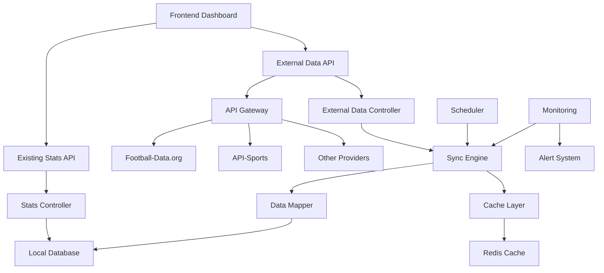

# Design Document - Integración de Datos Externos en Tiempo Real

## Overview

El diseño de la integración de datos externos transforma la aplicación en un sistema híbrido que combina entrada manual con sincronización automática de datos reales de LaLiga. La arquitectura se basa en un sistema de adaptadores para múltiples APIs, un motor de sincronización inteligente, y un sistema de cache multicapa que garantiza disponibilidad y rendimiento.

La solución mantiene la funcionalidad existente mientras añade capacidades de datos en tiempo real, siguiendo principios de tolerancia a fallos y degradación elegante.

## Architecture

### High-Level Architecture



### Component Architecture

1. **API Gateway Layer**
   - Multi-provider support (Football-Data.org, API-Sports, etc.)
   - Rate limiting and quota management
   - Failover and load balancing
   - Authentication and security

2. **Synchronization Engine**
   - Intelligent scheduling based on data type
   - Conflict resolution and data validation
   - Incremental updates and full synchronization
   - Error handling and retry mechanisms

3. **Data Mapping Layer**
   - Provider-agnostic data transformation
   - Schema validation and normalization
   - Conflict detection and resolution
   - Metadata preservation

4. **Cache System**
   - Multi-tier caching (Memory, Redis, Database)
   - TTL management based on data criticality
   - Cache invalidation strategies
   - Offline capability support

## Components and Interfaces

### 1. API Gateway

#### Provider Interface
```javascript
class APIProvider {
  constructor(config) {
    this.name = config.name;
    this.baseUrl = config.baseUrl;
    this.apiKey = config.apiKey;
    this.rateLimit = config.rateLimit;
  }
  
  async getTeams(competition) { /* Abstract method */ }
  async getPlayers(teamId) { /* Abstract method */ }
  async getMatches(competition, season) { /* Abstract method */ }
  async getMatchEvents(matchId) { /* Abstract method */ }
  async getStandings(competition) { /* Abstract method */ }
}
```

#### Specific Providers
```javascript
class FootballDataProvider extends APIProvider {
  async getTeams(competition = 'PD') { // PD = Primera División
    const response = await this.makeRequest(`/competitions/${competition}/teams`);
    return this.transformTeams(response.teams);
  }
  
  async getMatches(competition = 'PD', season = '2024') {
    const response = await this.makeRequest(`/competitions/${competition}/matches?season=${season}`);
    return this.transformMatches(response.matches);
  }
}

class APISportsProvider extends APIProvider {
  async getTeams(league = 140) { // 140 = La Liga
    const response = await this.makeRequest(`/teams?league=${league}&season=2024`);
    return this.transformTeams(response.response);
  }
}
```

### 2. Synchronization Engine

#### Core Sync Manager
```javascript
class SyncManager {
  constructor() {
    this.providers = new Map();
    this.scheduler = new SyncScheduler();
    this.mapper = new DataMapper();
    this.cache = new CacheManager();
  }
  
  async syncTeams(force = false) {
    const cacheKey = 'teams_laliga';
    
    if (!force && this.cache.isValid(cacheKey)) {
      return this.cache.get(cacheKey);
    }
    
    const provider = this.getActiveProvider();
    const externalTeams = await provider.getTeams();
    const mappedTeams = this.mapper.mapTeams(externalTeams);
    
    await this.persistTeams(mappedTeams);
    this.cache.set(cacheKey, mappedTeams, '24h');
    
    return mappedTeams;
  }
  
  async syncLiveMatches() {
    const provider = this.getActiveProvider();
    const liveMatches = await provider.getLiveMatches();
    
    for (const match of liveMatches) {
      const events = await provider.getMatchEvents(match.id);
      await this.processMatchEvents(match, events);
    }
  }
}
```

#### Scheduling System
```javascript
class SyncScheduler {
  constructor() {
    this.jobs = new Map();
    this.intervals = {
      teams: '24h',        // Teams sync once daily
      players: '12h',      // Players sync twice daily
      fixtures: '6h',      // Fixtures sync 4 times daily
      liveMatches: '5m',   // Live matches every 5 minutes
      standings: '1h'      // Standings every hour
    };
  }
  
  start() {
    // Schedule teams synchronization
    this.scheduleJob('teams', this.intervals.teams, () => {
      return this.syncManager.syncTeams();
    });
    
    // Schedule live matches (only during match days)
    this.scheduleConditionalJob('liveMatches', this.intervals.liveMatches, () => {
      return this.syncManager.syncLiveMatches();
    }, this.isMatchDay);
  }
}
```

### 3. Data Mapping Layer

#### Universal Data Mapper
```javascript
class DataMapper {
  constructor() {
    this.teamMappings = new Map();
    this.playerMappings = new Map();
    this.actionMappings = {
      'GOAL': 'Gol',
      'ASSIST': 'Asistencia',
      'YELLOW_CARD': 'Tarjeta Amarilla',
      'RED_CARD': 'Tarjeta Roja',
      'SUBSTITUTION': 'Sustitución',
      'FOUL': 'Falta'
    };
  }
  
  mapTeams(externalTeams) {
    return externalTeams.map(team => ({
      id: this.generateTeamId(team),
      name: this.normalizeTeamName(team.name),
      shortName: team.shortName || team.tla,
      logo: team.crest || team.logo,
      stadium: team.venue,
      founded: team.founded,
      externalId: team.id,
      provider: team._provider
    }));
  }
  
  mapMatchEvents(externalEvents, matchId) {
    return externalEvents.map(event => ({
      id: this.generateEventId(event, matchId),
      matchId: matchId,
      player: this.normalizePlayerName(event.player?.name),
      team: this.getTeamByExternalId(event.team?.id)?.name,
      action: this.actionMappings[event.type] || 'Otra',
      minute: event.minute,
      jornada: this.getJornadaFromMatch(matchId),
      timestamp: new Date(event.timestamp || Date.now()),
      metadata: {
        externalId: event.id,
        provider: event._provider,
        additionalInfo: event.detail
      }
    }));
  }
}
```

### 4. Cache System

#### Multi-Tier Cache Manager
```javascript
class CacheManager {
  constructor() {
    this.memoryCache = new Map();
    this.redisClient = new Redis(process.env.REDIS_URL);
    this.ttlDefaults = {
      teams: 24 * 60 * 60 * 1000,      // 24 hours
      players: 12 * 60 * 60 * 1000,    // 12 hours
      matches: 60 * 60 * 1000,         // 1 hour
      liveEvents: 5 * 60 * 1000,       // 5 minutes
      standings: 60 * 60 * 1000        // 1 hour
    };
  }
  
  async get(key) {
    // Try memory cache first
    if (this.memoryCache.has(key)) {
      const cached = this.memoryCache.get(key);
      if (cached.expires > Date.now()) {
        return cached.data;
      }
      this.memoryCache.delete(key);
    }
    
    // Try Redis cache
    const redisData = await this.redisClient.get(key);
    if (redisData) {
      const parsed = JSON.parse(redisData);
      // Promote to memory cache
      this.memoryCache.set(key, {
        data: parsed,
        expires: Date.now() + (5 * 60 * 1000) // 5 min in memory
      });
      return parsed;
    }
    
    return null;
  }
  
  async set(key, data, ttl) {
    const ttlMs = this.parseTTL(ttl);
    
    // Set in memory cache
    this.memoryCache.set(key, {
      data: data,
      expires: Date.now() + Math.min(ttlMs, 5 * 60 * 1000)
    });
    
    // Set in Redis cache
    await this.redisClient.setex(key, Math.floor(ttlMs / 1000), JSON.stringify(data));
  }
}
```

## Data Models

### Enhanced Models for External Data

```javascript
// Extended Team Model
const Team = {
  // Existing fields
  id: string,
  name: string,
  
  // New fields for external integration
  externalId: string,
  provider: string,
  shortName: string,
  logo: string,
  stadium: string,
  founded: number,
  country: string,
  website: string,
  
  // Sync metadata
  lastSynced: timestamp,
  syncStatus: 'active' | 'inactive' | 'error',
  
  // Cache info
  cacheExpires: timestamp
};

// Extended Player Model
const Player = {
  id: string,
  name: string,
  team: string,
  
  // New fields
  externalId: string,
  provider: string,
  position: string,
  shirtNumber: number,
  age: number,
  nationality: string,
  height: number,
  weight: number,
  
  // Sync metadata
  lastSynced: timestamp,
  isActive: boolean
};

// Match Model
const Match = {
  id: string,
  homeTeam: string,
  awayTeam: string,
  jornada: number,
  date: timestamp,
  
  // New fields
  externalId: string,
  provider: string,
  status: 'scheduled' | 'live' | 'finished' | 'postponed',
  homeScore: number,
  awayScore: number,
  stadium: string,
  referee: string,
  
  // Live data
  currentMinute: number,
  isLive: boolean,
  lastEventSync: timestamp
};

// Sync Log Model
const SyncLog = {
  id: string,
  operation: string, // 'teams', 'players', 'matches', 'events'
  provider: string,
  status: 'success' | 'error' | 'partial',
  startTime: timestamp,
  endTime: timestamp,
  recordsProcessed: number,
  recordsCreated: number,
  recordsUpdated: number,
  errors: array,
  metadata: object
};
```

## Error Handling

### Resilience Patterns

1. **Circuit Breaker Pattern**
   - Monitor API health and automatically disable failing providers
   - Gradual recovery with exponential backoff
   - Fallback to cached data during outages

2. **Retry Mechanisms**
   - Exponential backoff for transient failures
   - Different retry strategies per operation type
   - Maximum retry limits to prevent infinite loops

3. **Graceful Degradation**
   - Continue operation with cached data when APIs fail
   - Clear user notifications about data freshness
   - Automatic recovery when services restore

### Error Categories and Responses

```javascript
class ErrorHandler {
  handleAPIError(error, provider, operation) {
    switch (error.type) {
      case 'RATE_LIMIT_EXCEEDED':
        return this.handleRateLimit(provider, error.resetTime);
      
      case 'AUTHENTICATION_FAILED':
        return this.handleAuthError(provider);
      
      case 'SERVICE_UNAVAILABLE':
        return this.handleServiceDown(provider, operation);
      
      case 'DATA_VALIDATION_FAILED':
        return this.handleDataError(error.data, operation);
      
      default:
        return this.handleGenericError(error, provider, operation);
    }
  }
}
```

## Testing Strategy

### Integration Testing
- **API Provider Tests**: Mock external APIs and test all provider implementations
- **Sync Engine Tests**: Test synchronization logic with various data scenarios
- **Cache Tests**: Verify cache behavior under different load conditions
- **Mapping Tests**: Ensure data transformation accuracy across providers

### Performance Testing
- **Load Testing**: Simulate high-frequency sync operations
- **Cache Performance**: Measure cache hit rates and response times
- **API Rate Limiting**: Test behavior under rate limit constraints
- **Memory Usage**: Monitor memory consumption during large sync operations

### Reliability Testing
- **Failover Testing**: Verify provider switching works correctly
- **Data Consistency**: Ensure data integrity during sync operations
- **Recovery Testing**: Test system recovery after various failure scenarios
- **Offline Mode**: Verify application works with cached data only

## Implementation Notes

### Phase 1: Core Infrastructure (Week 1)
1. Implement API Gateway with Football-Data.org provider
2. Create basic sync engine for teams and players
3. Setup Redis cache infrastructure
4. Implement data mapping layer

### Phase 2: Live Data Integration (Week 2)
1. Add match and event synchronization
2. Implement live match monitoring
3. Create scheduling system for different data types
4. Add error handling and retry mechanisms

### Phase 3: Advanced Features (Week 3)
1. Add multiple provider support (API-Sports)
2. Implement monitoring dashboard
3. Add manual sync controls
4. Create alerting system

### Technical Considerations
- **API Costs**: Monitor and optimize API usage to control costs
- **Rate Limiting**: Respect provider limits and implement intelligent queuing
- **Data Privacy**: Ensure compliance with data protection regulations
- **Scalability**: Design for future expansion to other leagues/sports
- **Monitoring**: Comprehensive logging and metrics for operational visibility